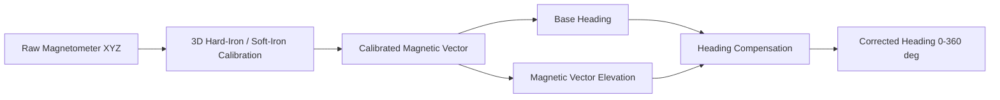
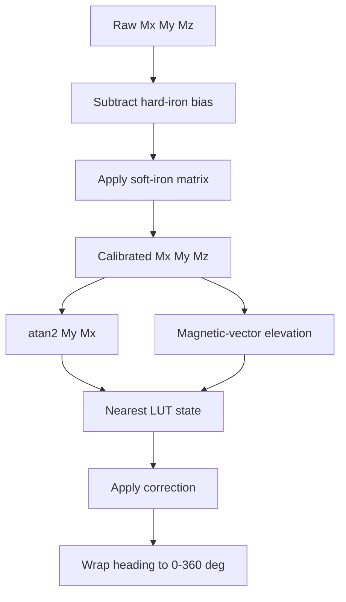
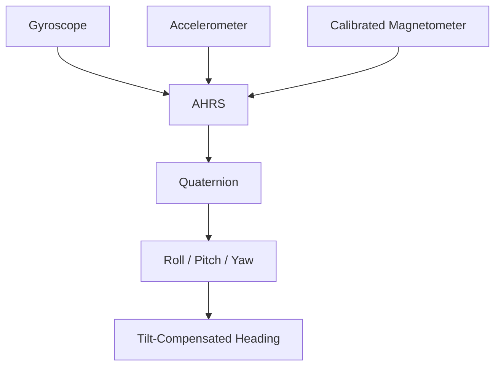

# Tilt-Compensated Magnetometer Heading

A practical robotics project for **3D magnetometer calibration**, **tilt-induced heading error analysis**, and **heading compensation on a pitching platform**.

The system was developed for a two-axis mechanism with approximately:

- **Yaw:** `0° to 360°`
- **Pitch:** `-40° to +40°`

The problem was straightforward:

> **When physical yaw is fixed, changing pitch should not change the reported heading.**

At a physical yaw of approximately `90°`, the calibrated magnetometer could report roughly:

| Pitch | Measured heading |
|---:|---:|
| `-40°` | `~70°` |
| `0°` | `~90°` |
| `+40°` | `~111°` |

The magnetometer was already hard/soft-iron calibrated, so this was not just a basic calibration problem. The remaining error was caused by the changing orientation of the magnetic-field vector relative to the sensor frame.

This repository documents the approaches we tested, the calibration mathematics, the reusable Python implementation, and the current direction toward full AHRS sensor fusion.

---

## Overview



The work progressed through three practical compensation approaches:

```text
1. Magnetometer-state LUT
2. Encoder-based tilt compensation
3. IMU-based pitch estimation using accelerometer + gyroscope

Next phase:
4. Full AHRS using Madgwick / xioTechnologies Fusion
```

---

# 1. Why normal magnetic heading changes with pitch

A conventional level heading is:

\[
\psi = \operatorname{atan2}(M_y, M_x)
\]

This assumes that the magnetic X/Y components are being interpreted in a suitable horizontal plane.

When the sensor pitches, the Earth's magnetic field rotates relative to the sensor axes. Therefore the measured `Mx`, `My`, and `Mz` change even if the physical yaw is unchanged.

So:

```text
same yaw + different pitch
             ↓
different magnetic projection
             ↓
different atan2(My, Mx)
```

Hard-iron and soft-iron calibration correct magnetic distortion, but they do not by themselves estimate 3D orientation.

---

# 2. 3D magnetometer calibration

An ideal 3-axis magnetometer rotated through many orientations should form a sphere centered around the origin.

In a real robot, the measurements are shifted and distorted by:

- motors
- permanent magnetic fields
- wiring
- power electronics
- nearby ferromagnetic material
- mechanical structure
- sensor mounting

We model the calibrated magnetic vector as:

\[
\boxed{
m_{cal} = (m_{raw} - b)A
}
\]

where:

- \(m_{raw}\) is the raw magnetometer vector
- \(b\) is the hard-iron bias
- \(A\) is the soft-iron correction matrix

## Calibration values obtained in our setup

Hard-iron bias:

```python
HARD_IRON_BIAS = [
    130.054348,
    -52.792277,
    -175.082933
]
```

Soft-iron matrix:

```python
SOFT_IRON_MATRIX = [
    [0.002010925,  0.000005664,  0.000191615],
    [0.000005664,  0.002092747, -0.000034360],
    [0.000191615, -0.000034360,  0.002238688]
]
```

Application:

```python
calibrated = (raw - HARD_IRON_BIAS) @ SOFT_IRON_MATRIX
```

> These values are specific to the experimental robot and its magnetic environment. They should not be copied blindly to another platform.

---

# 3. Ellipsoid fitting method

The raw samples were fitted to the algebraic ellipsoid:

\[
ax^2 + by^2 + cz^2
+ 2dxy + 2exz + 2fyz
+ gx + hy + iz = 1
\]

The least-squares design matrix is:

```python
D = np.column_stack(
    (
        x*x,
        y*y,
        z*z,
        2*x*y,
        2*x*z,
        2*y*z,
        x,
        y,
        z,
    )
)

parameters = np.linalg.lstsq(
    D,
    np.ones(len(x)),
    rcond=None,
)[0]
```

The quadratic matrix is:

\[
Q =
\begin{bmatrix}
a & d & e \\
d & b & f \\
e & f & c
\end{bmatrix}
\]

and the linear vector is:

\[
q =
\begin{bmatrix}
g \\
h \\
i
\end{bmatrix}
\]

The fitted center is:

\[
\boxed{
c = -\frac{1}{2}Q^{-1}q
}
\]

After normalization, the ellipsoid shape is decomposed as:

\[
Q_s = V\Lambda V^T
\]

and the square-root transform is used to map the ellipsoid approximately into a sphere:

\[
A = V\sqrt{\Lambda}V^T
\]

The complete reusable implementation is in [`src/calibration.py`](src/calibration.py).

---

# 4. Calibration quality

The calibration dataset contained:

```text
7869 samples
```

Before calibration:

| Metric | Result |
|---|---:|
| Mean magnitude deviation | `13.324%` |
| RMS magnitude deviation | `16.562%` |
| Maximum magnitude deviation | `40.933%` |

After calibration:

| Metric | Result |
|---|---:|
| Mean magnitude deviation | `0.976%` |
| RMS magnitude deviation | `1.286%` |
| Mean calibrated magnitude | `0.999513` |
| Standard deviation | `0.012852` |

The ellipsoid was therefore transformed very close to a sphere.

The important observation was that **good magnetic calibration did not eliminate pitch-induced heading error**.

---

# 5. Approaches evaluated

## Approach 1 — Magnetometer-state lookup table

The first compensation method was intentionally magnetometer-only.

After calibration, we calculate:

### Base heading

\[
\psi_m = \operatorname{atan2}(M_y, M_x)
\]

```python
heading = np.degrees(
    np.arctan2(my, mx)
) % 360.0
```

### Magnetic-vector elevation

\[
\alpha_m =
\operatorname{atan2}
\left(
M_z,
\sqrt{M_x^2 + M_y^2}
\right)
\]

```python
mag_elevation = np.degrees(
    np.arctan2(
        mz,
        np.sqrt(mx*mx + my*my)
    )
)
```

`mag_elevation` is **not mechanical pitch**. It is the elevation of the measured magnetic-field vector in the sensor frame.

The empirical state was therefore:

```text
(
    calibrated magnetic heading,
    magnetic-vector elevation
)
```

and the LUT stores:

```text
magnetic state → heading correction
```

The first LUT used approximately `5° × 5°` bins and contained `851` populated cells.

### Circular correction

Angles must be compared circularly:

```python
def angle_difference(target_deg, measured_deg):
    return (
        (
            target_deg
            - measured_deg
            + 180.0
        )
        % 360.0
    ) - 180.0
```

This correctly handles cases such as:

```text
target   =   2°
measured = 358°

correction = +4°
```

instead of `-356°`.

### Result

The LUT removed a substantial part of the pitch-dependent error.

Representative measurements:

| Actual yaw | Pitch | Before | After LUT |
|---:|---:|---:|---:|
| 45° | +40° | 80° | 47° |
| 45° | 0° | 44° | 45° |
| 45° | -40° | 37° | 43° |
| 90° | +40° | 111° | 97° |
| 90° | -40° | 70° | 88° |
| 135° | -40° | 105° | 135° |
| 270° | +40° | 247° | 260° |
| 270° | 0° | 267° | 270° |
| 270° | -40° | 285° | 268° |

Across one small validation set, the mean absolute error dropped by roughly **75%**.

### Lookup strategy

A nearest populated cell performed better than a naive four-neighbor inverse-distance interpolation in our tests.

The interpolation could blend together nearby but meaningfully different correction states.

The current implementation therefore keeps the simple nearest-state method.

---

## Approach 2 — Pitch encoder compensation

The second approach used the known mechanical pitch angle from the platform encoder.

For a pitch rotation about the sensor Y axis, a common tilt-compensation form is:

\[
X_h = M_x\cos\theta + sM_z\sin\theta
\]

\[
Y_h = M_y
\]

where:

- \(\theta\) is the measured platform pitch
- \(s\) depends on the sensor-axis/sign convention

The compensated heading is then:

\[
\psi =
\operatorname{atan2}(Y_h, X_h)
\]

This approach has an important advantage:

> the tilt angle is directly measured.

It was useful for understanding whether the remaining heading error was genuinely related to pitch geometry.

However, it also introduces a system dependency:

```text
magnetometer heading
+
encoder zero
+
encoder sign
+
mechanical alignment
```

Any offset between the encoder frame and magnetometer frame appears directly in the heading.

The project goal was to obtain a heading solution that could operate from the IMU itself, so the encoder-based method was treated as a useful experimental reference rather than the final architecture.

---

## Approach 3 — Accelerometer + gyroscope pitch estimation

The third approach removed the mechanical pitch dependency and estimated pitch from the IMU.

### Accelerometer pitch

When linear acceleration is low, gravity provides an absolute tilt reference:

\[
\theta_{acc}
=
\operatorname{atan2}
\left(
a_x,
\sqrt{a_y^2+a_z^2}
\right)
\]

```python
pitch_acc = np.degrees(
    np.arctan2(
        ax,
        np.sqrt(ay*ay + az*az)
    )
)
```

### Gyroscope integration

The gyroscope tracks short-term angular motion:

\[
\theta_{gyro,k}
=
\theta_{k-1}
+
\omega_y\Delta t
\]

where the time interval is calculated from the sensor timestamp:

\[
\Delta t =
\frac{t_k-t_{k-1}}{10^6}
\]

### Complementary filter

The two estimates were fused using:

\[
\boxed{
\theta_k
=
\alpha\theta_{gyro,k}
+
(1-\alpha)\theta_{acc,k}
}
\]

with:

```python
alpha = 0.98
```

This combines:

```text
Gyroscope:
fast response, good during motion, but drifts

Accelerometer:
absolute gravity reference, but noisy under acceleration
```

The pitch sign and direction were validated experimentally on the platform.

This approach demonstrated that the system can estimate the platform's tilt without relying on the mechanical encoder.

It also naturally leads to the next stage: estimating the complete 3D attitude instead of estimating pitch separately.

---

# 6. Why the reference compass was removed from the final LUT concept

During the first LUT experiment, another compass was used as the heading reference.

A constant orientation offset can be removed mathematically, but a second compass can still introduce:

- its own calibration error
- magnetic disturbance
- mounting misalignment
- timestamp mismatch

This matters particularly when yaw is changing.

The cleaner LUT training target is therefore known physical yaw:

\[
\boxed{
Correction =
ActualYaw - MeasuredHeading
}
\]

using circular angle subtraction.

Example:

```text
Actual yaw = 90°
Measured   = 111.14°

Required correction = -21.14°
```

and:

```text
Actual yaw = 270°
Measured   = 247.20°

Required correction = +22.80°
```

---

# 7. LUT training algorithm

A repeatable calibration can use a yaw/pitch grid such as:

```text
Yaw:
0, 45, 90, 135, 180, 225, 270, 315 degrees

Pitch:
-40, -30, -20, -10, 0, +10, +20, +30, +40 degrees
```

At each stationary pose:

```text
1. Collect raw magnetometer samples

2. Apply 3D calibration:
       m_cal = (m_raw - bias) @ matrix

3. Calculate:
       magnetic heading
       magnetic-vector elevation

4. Calculate:
       correction = circular_difference(
           actual_yaw,
           magnetic_heading
       )

5. Bin the magnetic state

6. Calculate a circular mean correction for each populated bin

7. Save the LUT
```

A script implementing this process is included as:

[`scripts/build_lut.py`](scripts/build_lut.py)

---

# 8. Runtime algorithm



Equivalent pseudocode:

```text
raw = [Mx, My, Mz]

calibrated =
    (raw - hard_iron_bias)
    @ soft_iron_matrix

heading =
    atan2(
        calibrated_y,
        calibrated_x
    )

mag_elevation =
    atan2(
        calibrated_z,
        sqrt(
            calibrated_x²
            + calibrated_y²
        )
    )

correction =
    nearest_LUT(
        heading,
        mag_elevation
    )

final_heading =
    wrap360(
        heading
        + correction
    )
```

---

# 9. Python usage

Install:

```bash
python3 -m venv .venv
source .venv/bin/activate
pip install -r requirements.txt
```

Minimal example:

```python
import numpy as np

from src.heading import (
    apply_calibration,
    magnetic_heading_deg,
    magnetic_elevation_deg,
)

raw = np.array([
    mag_x,
    mag_y,
    mag_z,
])

calibrated = apply_calibration(raw)

heading = magnetic_heading_deg(calibrated)
mag_elevation = magnetic_elevation_deg(calibrated)

print(f"Heading: {heading:.2f} deg")
print(f"Magnetic elevation: {mag_elevation:.2f} deg")
```

Run:

```bash
python3 examples/quick_start.py
```

---

# 10. Fit a new magnetometer

Expected CSV:

```csv
mag_x,mag_y,mag_z
131,-54,-403
129,-51,-399
...
```

Run:

```bash
python3 scripts/fit_calibration.py data/magnetometer_samples.csv
```

The script reports:

```text
Hard-iron bias
Soft-iron matrix
Calibration magnitude statistics
```

---

# 11. Build a known-yaw correction LUT

Expected CSV:

```csv
mag_x,mag_y,mag_z,current_pitch,actual_yaw
...
```

Build:

```bash
python3 scripts/build_lut.py \
    data/known_yaw_dataset.csv \
    magstate_lut.json
```

The generated JSON maps:

```text
"heading_bin,mag_elevation_bin"
```

to a signed heading correction in degrees.

---

# 12. Repository structure

```text
tilt-compensated-magnetometer-heading/
│
├── README.md
├── requirements.txt
│
├── src/
│   ├── __init__.py
│   ├── calibration.py
│   └── heading.py
│
├── scripts/
│   ├── fit_calibration.py
│   └── build_lut.py
│
├── examples/
│   └── quick_start.py
│
├── docs/
│   └── ALGORITHM.md
│
└── data/
    └── README.md
```

---

# 13. Next phase — full AHRS

The compensation experiments showed the progression clearly:

```text
Magnetometer only
       ↓
Magnetometer + encoder pitch
       ↓
Magnetometer + IMU-estimated pitch
       ↓
Full 3D sensor fusion
```

The next architecture is a 9-DoF AHRS:



Two implementations are of particular interest:

### Madgwick AHRS

Madgwick combines:

```text
gyroscope
+
accelerometer
+
magnetometer
```

to estimate a quaternion representing the sensor orientation.

### xioTechnologies Fusion

Fusion provides a mature AHRS implementation with additional rejection and bias-handling logic that is useful on moving robotic systems.

The UART timestamps can be used directly for the AHRS integration interval:

\[
\Delta t =
\frac{t_k-t_{k-1}}{10^6}
\]

The intended final pipeline is:

```text
Gyro raw
  ↓
scale + bias correction
  ┐
  │
Accel raw
  ↓
scale / normalization
  ├──> AHRS ──> Quaternion ──> Yaw ──> Heading
  │
Mag raw
  ↓
3D hard/soft-iron calibration
  ┘
```

---

# 14. Engineering observations

### Calibration quality and heading quality are different metrics

A nearly spherical calibrated point cloud does not guarantee correct heading under tilt.

### Magnetometer-only compensation can work well in constrained motion

For a system with fixed roll and bounded pitch, the calibrated magnetic vector can contain useful orientation-dependent structure.

### Encoder compensation is valuable as a reference

It provides a direct known tilt measurement and helps separate magnetic calibration problems from geometric tilt problems.

### Accelerometer and gyroscope remove the encoder dependency

The accelerometer provides a gravity reference while the gyro tracks motion between gravity corrections.

### Full AHRS is the natural final architecture

Once gyro, accelerometer, and calibrated magnetometer data are available, estimating the complete orientation is more general than applying an independent pitch correction.

### Ground truth matters

A correction model is only as reliable as the heading reference used to train and validate it.

### Angle math must be circular

All angle differences and averages should respect wraparound at `0° / 360°`.

---

# 15. Scope and limitations

The LUT approach is empirical and robot-specific.

Its performance can change with:

- magnetic environment
- motor current
- wiring changes
- sensor relocation
- added ferromagnetic material
- operation outside the trained orientation range

The included calibration constants represent one experimental installation.

This repository should therefore be treated as a reproducible engineering method rather than a universal set of calibration numbers.

---

## Summary

The project started with a calibrated magnetometer whose heading still changed by tens of degrees as the platform pitched.

The investigation progressed through:

```text
3D magnetic calibration
        ↓
magnetometer-state LUT
        ↓
encoder-based tilt compensation
        ↓
accelerometer + gyro pitch estimation
        ↓
full AHRS direction
```

The key result is that **hard/soft-iron calibration and tilt compensation are separate problems**.

The LUT experiments demonstrated a large reduction in pitch-related heading error, while the encoder and IMU experiments clarified how physical tilt can be incorporated explicitly.

The next stage uses the same calibrated magnetic vector together with accelerometer and gyroscope measurements in Madgwick/xioTechnologies Fusion to estimate the complete 3D attitude and obtain continuous tilt-compensated heading.
