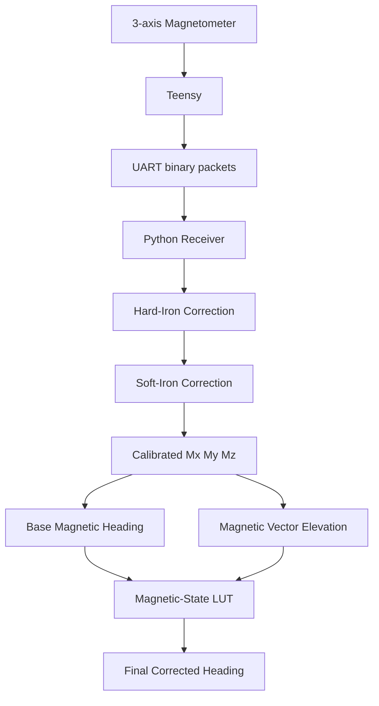

# Tilt-Compensated Magnetometer Heading

Practical magnetometer calibration and tilt-compensated heading correction for robotic platforms using **3D hard/soft-iron calibration**, **error analysis**, and an **empirical magnetic-state lookup table (LUT)**.

> **Goal:** if physical yaw is fixed, the reported heading should remain approximately constant while the sensor platform pitches.

---

## Why this project exists

A normal magnetic heading is usually calculated as:

```python
heading = atan2(My, Mx)
```

That works well when the magnetometer is close to level. On our pitching platform, however, the same physical yaw produced very different headings as pitch changed.

One representative test at a physical yaw of about `90°` was:

| Physical yaw | Pitch | Calibrated magnetic heading |
|---:|---:|---:|
| 90° | -40° | ~70° |
| 90° | 0° | ~90° |
| 90° | +40° | ~111° |

The magnetometer was already hard/soft-iron calibrated, so the remaining problem was not simply an uncalibrated sensor. The Earth's magnetic-field vector is projected differently into the sensor frame when the platform tilts.

---

## Project status

- [x] UART sensor acquisition
- [x] 3D hard-iron calibration
- [x] 3D soft-iron calibration
- [x] Calibration-quality analysis
- [x] Pitch-induced heading-error characterization
- [x] Magnetometer-state LUT prototype
- [x] Live validation
- [x] Nearest-cell vs interpolation experiment
- [ ] Rebuild LUT using known physical yaw as ground truth
- [ ] Verify final IMU firmware/scaling against installed hardware
- [ ] Gyroscope and accelerometer calibration
- [ ] AHRS comparison using Madgwick / Mahony / Fusion
- [ ] Dynamic-motion validation

---

# 1. System architecture



Our newer hardware notes identify the board as a **Pololu AltIMU-10 v6**. Some earlier firmware experiments referenced older sensor ICs, so raw-count scale factors and register settings should be verified against the exact firmware and installed board before reuse.

---

# 2. Add real project photos

Create these files when you upload the real images:

```text
docs/images/platform_overview.jpg
docs/images/imu_mount.jpg
docs/images/calibration_motion.jpg
docs/images/raw_vs_calibrated.png
docs/images/heading_vs_pitch.png
```

Then add:

```markdown
## Hardware setup


### IMU mounting


### Calibration motion


### Raw vs calibrated magnetometer


### Heading error vs pitch

```

---

# 3. Hard-iron and soft-iron calibration

An ideal 3-axis magnetometer rotated through many orientations should produce points on a sphere centered around the origin. Real robotic systems distort that field because of motors, wiring, batteries, structural material, nearby electronics, and sensor mounting.

We model the calibrated magnetic vector as:

\[
\boxed{m_{cal} = (m_{raw} - b)A}
\]

where:

- `b` = hard-iron bias vector
- `A` = soft-iron correction matrix

The experimental values from our robot were:

```python
HARD_IRON_BIAS = [
    130.054348,
    -52.792277,
    -175.082933
]

SOFT_IRON_MATRIX = [
    [0.002010925,  0.000005664,  0.000191615],
    [0.000005664,  0.002092747, -0.000034360],
    [0.000191615, -0.000034360,  0.002238688]
]
```

> **Do not reuse these numbers on another robot.** They are specific to our sensor, mounting, robot structure, and calibration environment.

Runtime application:

```python
calibrated = (raw - HARD_IRON_BIAS) @ SOFT_IRON_MATRIX
```

---

# 4. How the 3D calibration was calculated

We fitted an algebraic ellipsoid:

\[
ax^2 + by^2 + cz^2 + 2dxy + 2exz + 2fyz + gx + hy + iz = 1
\]

with the least-squares design matrix:

```python
D = np.column_stack((
    x*x,
    y*y,
    z*z,
    2*x*y,
    2*x*z,
    2*y*z,
    x,
    y,
    z,
))

parameters = np.linalg.lstsq(
    D,
    np.ones(len(x)),
    rcond=None,
)[0]
```

The quadratic matrix is:

\[
Q =
\begin{bmatrix}
a & d & e\\
d & b & f\\
e & f & c
\end{bmatrix}
\]

and the linear vector is:

\[
q =
\begin{bmatrix}
g\\h\\i
\end{bmatrix}
\]

The ellipsoid center is:

\[
\boxed{c = -\frac{1}{2}Q^{-1}q}
\]

After normalization, eigenvalue decomposition is used to derive the square-root transform that maps the ellipsoid approximately to a unit sphere.

A reusable implementation is included in:

```text
src/magnetometer_utils.py
```

---

# 5. Calibration quality

Our dataset contained `7869` magnetometer samples.

Before calibration:

| Metric | Result |
|---|---:|
| Mean magnitude deviation | 13.324% |
| RMS magnitude deviation | 16.562% |
| Maximum deviation | 40.933% |

After calibration:

| Metric | Result |
|---|---:|
| Mean magnitude deviation | 0.976% |
| RMS magnitude deviation | 1.286% |
| Mean calibrated magnitude | 0.999513 |
| Standard deviation | 0.012852 |

The ellipsoid was transformed very close to a sphere, but that still did **not** guarantee tilt-independent heading.

---

# 6. Why heading still changes with pitch

The basic magnetic heading is:

\[
\psi = \operatorname{atan2}(M_y,M_x)
\]

When the sensor pitches, the Earth's magnetic vector rotates relative to the sensor X/Y plane. Therefore:

```text
same physical yaw
+
different sensor pitch
=
different X/Y magnetic projection
```

Hard/soft-iron calibration corrects magnetic distortion. It does not estimate the complete 3D orientation of the sensor.

---

# 7. Magnetometer-only correction idea

We wanted to see how much pitch-related error could be corrected **without using a pitch encoder at runtime**.

First calculate the calibrated magnetic heading:

```python
heading = (
    np.degrees(np.arctan2(my, mx))
    % 360.0
)
```

Then calculate magnetic-vector elevation:

\[
\alpha_m = \operatorname{atan2}\left(M_z,\sqrt{M_x^2+M_y^2}\right)
\]

```python
mag_tilt = np.degrees(
    np.arctan2(
        mz,
        np.sqrt(mx*mx + my*my)
    )
)
```

`mag_tilt` is **not mechanical pitch**. It is the elevation angle of the calibrated magnetic-field vector in the sensor frame.

The LUT therefore maps:

```text
(calibrated magnetic heading, magnetic-vector elevation)
                         ↓
                  heading correction
```

---

# 8. Circular angle math

Angles cannot be treated as ordinary scalar values around the `0° / 360°` boundary.

Use:

```python
def angle_difference(target_deg, measured_deg):
    return (
        (
            target_deg
            - measured_deg
            + 180.0
        )
        % 360.0
    ) - 180.0
```

Example:

```text
target   = 2°
measured = 358°
result   = +4°
```

---

# 9. Improved LUT training method

Our first LUT used another compass as a temporary heading reference. That proved the concept, but it could introduce mounting offset, reference calibration error, magnetic disturbance, and timing mismatch while yaw was moving.

The preferred target is now:

\[
\boxed{Correction = ActualYaw - MeasuredHeading}
\]

with circular wrapping.

Example:

```text
Actual yaw     = 90°
Measured       = 111.14°
Correction     = -21.14°
```

and:

```text
Actual yaw     = 270°
Measured       = 247.20°
Correction     = +22.80°
```

---

# 10. Recommended ground-truth dataset

Use stationary measurements at:

```text
Yaw:
0°, 45°, 90°, 135°, 180°, 225°, 270°, 315°

Pitch:
-40°, -30°, -20°, -10°, 0°,
+10°, +20°, +30°, +40°
```

This gives `8 × 9 = 72` poses.

At every pose:

1. move to the desired yaw/pitch;
2. stop the platform;
3. wait for vibration to settle;
4. record 50–100 magnetometer samples;
5. calibrate every sample;
6. compute magnetic heading and magnetic elevation;
7. compute correction from known physical yaw;
8. aggregate the samples into the LUT.

A suggested CSV format is:

```csv
timestamp_us,mag_x,mag_y,mag_z,current_pitch,actual_yaw
1000000,120,-65,-401,40,90
1004545,122,-64,-399,40,90
```

---

# 11. Training algorithm

```text
FOR every known calibration pose:

    Set physical yaw = Y_true
    Set physical pitch = P

    Wait until stationary

    Collect N magnetometer samples

    FOR each sample:

        raw = [Mx, My, Mz]

        calibrated =
            (raw - HARD_IRON_BIAS)
            @ SOFT_IRON_MATRIX

        heading =
            atan2(calibrated_y, calibrated_x)

        mag_elevation =
            atan2(
                calibrated_z,
                sqrt(
                    calibrated_x²
                    + calibrated_y²
                )
            )

        correction =
            circular_difference(
                Y_true,
                heading
            )

        Store:
            heading
            mag_elevation
            correction

Aggregate / bin samples
Save LUT
```

---

# 12. Runtime algorithm

```text
Raw Mx My Mz
     ↓
Subtract hard-iron bias
     ↓
Apply soft-iron matrix
     ↓
Calibrated Mx My Mz
     ↓
Base magnetic heading
     +
Magnetic-vector elevation
     ↓
Find nearest reliable LUT cell
     ↓
Apply correction
     ↓
Wrap to 0°–360°
     ↓
Final heading
```

---

# 13. Experimental results

Representative live tests:

| Actual yaw | Pitch | Before LUT | After LUT |
|---:|---:|---:|---:|
| 45° | +40° | 80° | 47° |
| 45° | 0° | 44° | 45° |
| 45° | -40° | 37° | 43° |
| 90° | +40° | 111° | 97° |
| 90° | 0° | 89° | 86° |
| 90° | -40° | 70° | 88° |
| 135° | -40° | 105° | 135° |
| 270° | +40° | 247° | 260° |
| 270° | 0° | 267° | 270° |
| 270° | -40° | 285° | 268° |

Across one small validation set, the mean absolute error decreased by roughly **75%**.

This is an experimental result, not a guaranteed accuracy specification.

---

# 14. Nearest-cell vs interpolation

We tested a four-neighbor inverse-distance interpolation. It did not consistently improve the result.

Example:

```text
Actual yaw = 135°
Pitch      = -40°

Nearest-cell LUT: ~135°
Interpolated LUT: ~128°
```

For the current prototype, we therefore use the **nearest populated LUT cell**. A cleaner and denser ground-truth dataset may make interpolation useful later.

---

# 15. Getting started

Clone the repository:

```bash
git clone https://github.com/YOUR_USERNAME/tilt-compensated-magnetometer-heading.git
cd tilt-compensated-magnetometer-heading
```

Create an environment:

```bash
python3 -m venv .venv
source .venv/bin/activate
```

Install dependencies:

```bash
pip install -r requirements.txt
```

Run the example from the repository root:

```bash
python3 examples/quick_start.py
```

---

# 16. Minimal Python usage

```python
import numpy as np

from src.magnetometer_utils import (
    apply_calibration,
    magnetic_heading_deg,
    magnetic_elevation_deg,
)

raw = np.array([
    mag_x,
    mag_y,
    mag_z,
])

cal = apply_calibration(raw)

heading = magnetic_heading_deg(cal)
mag_elevation = magnetic_elevation_deg(cal)

print(f"Heading: {heading:.2f} deg")
print(f"Magnetic elevation: {mag_elevation:.2f} deg")
```

---

# 17. Fit your own calibration

Never reuse another robot's hard/soft-iron values.

Prepare a CSV:

```csv
mag_x,mag_y,mag_z
125,-80,-410
127,-77,-405
```

Then:

```python
import numpy as np

from src.magnetometer_utils import fit_ellipsoid_calibration

samples = np.loadtxt(
    "data/your_mag_samples.csv",
    delimiter=",",
    skiprows=1,
    usecols=(0, 1, 2),
)

bias, matrix = fit_ellipsoid_calibration(samples)

print("Bias:")
print(bias)

print("Correction matrix:")
print(matrix)
```

For a good 3D fit, move the sensor through as much orientation space as the mechanism safely allows.

---

# 18. Repository structure

```text
tilt-compensated-magnetometer-heading/
│
├── README.md
├── requirements.txt
│
├── src/
│   ├── __init__.py
│   └── magnetometer_utils.py
│
├── examples/
│   └── quick_start.py
│
├── data/
│   └── README.md
│
└── docs/
    └── images/
        └── .gitkeep
```

Later we can add:

```text
scripts/
    fit_calibration.py
    build_lut.py
    live_heading.py

plots/
    raw_ellipsoid.png
    calibrated_sphere.png
    heading_error_vs_pitch.png

docs/
    calibration_math.md
    experiment_protocol.md
    ahrs_comparison.md
```

---

# 19. Limitations

This project currently demonstrates an empirical, robot-specific correction.

Important limitations include:

- magnetic interference may change after hardware changes;
- motor current can generate non-static magnetic fields;
- another environment may have a different local magnetic field;
- the LUT should not be extrapolated blindly outside its training state space;
- rapid motion is better handled with gyro/accelerometer fusion;
- calibration constants are not transferable between robots.

---

# 20. Next phase: AHRS

The longer-term comparison is:

```text
Gyroscope
    +
Accelerometer
    +
Calibrated magnetometer
    ↓
Madgwick / Mahony / Fusion
    ↓
Quaternion
    ↓
Roll / Pitch / Yaw
    ↓
Tilt-compensated heading
```

The UART timestamp can be used to compute the real integration interval:

\[
\Delta t = \frac{t_k - t_{k-1}}{10^6}
\]

This avoids assuming a perfectly fixed update interval.

---

# Key lessons

- A good ellipsoid fit does **not** guarantee good heading while tilted.
- Hard/soft-iron calibration and tilt compensation solve different problems.
- Known physical yaw is preferable to another unsynchronized compass for LUT ground truth.
- Angle differences and means must use circular math.
- Calibrate the **complete robot configuration**, not just the loose sensor.
- Validate on data that was not used to build the correction.

---

# Contributing

If you test this approach on another robotic platform, useful contributions include calibration datasets, before/after plots, interpolation experiments, AHRS comparisons, sensor-frame examples, and magnetic-interference tests.

When sharing results, document the sensor model, mounting arrangement, calibration procedure, physical-yaw reference, and test conditions.

---

# Disclaimer

This repository documents an experimental engineering workflow. Do not assume the included calibration constants are valid for another sensor or robot. For navigation or safety-critical systems, validate the estimator under the actual operating conditions.
